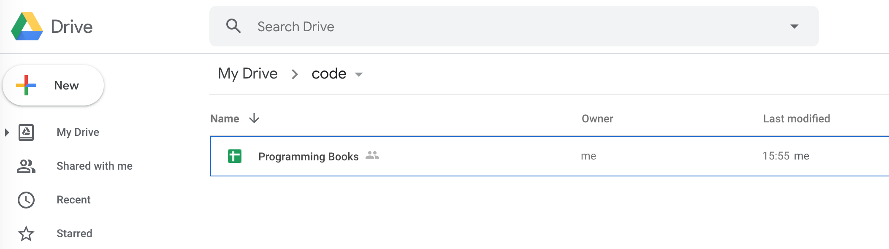
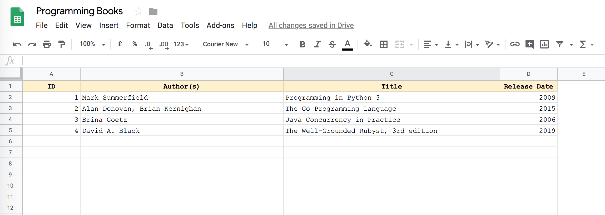

# Using Google Sheet as a database

This is a simple app that show how you can use [Google Sheet](https://www.google.com/sheets/about/) 
as a [database](https://www.wikiwand.com/en/Database).

#### Prerequisites

Create a new project on [Google API Console](https://console.developers.google.com), 
enable both the Google Drive and Google Sheet APIs, 
follow this [guide](https://www.twilio.com/blog/2017/02/an-easy-way-to-read-and-write-to-a-google-spreadsheet-in-python.html).

I am assuming that you have created a spreasheet (on your Google Drive).



The client script is written in [Python](https://www.python.org/), 
so make sure you have [Python](https://www.python.org/) installed.

(recommended): *setup [pipenv](https://pipenv.readthedocs.io/en/latest/), [virtualenv](https://virtualenv.pypa.io/en/latest/) or [virtualenvwrapper](https://virtualenvwrapper.readthedocs.io/en/latest/)*

##### Usage

```
$> cd {APP_DIRECTORY} && pip install -r requirements.txt
```

```
$> python app.py
```

###### Some cool articles
- [Google Sheet API](https://developers.google.com/sheets/api/guides/authorizing) guide.
- [gspread](https://gspread.readthedocs.io/en/latest/index.html) guide.

